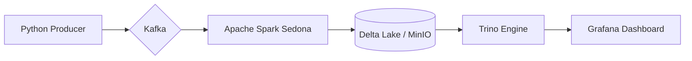

# Data-Geo: Real-time Vehicle Tracking Pipeline

## 1. Tổng quan (Overview)

Hệ thống **Data-Geo** là một Pipeline xử lý dữ liệu không gian thời gian thực (Real-time Spatial Data Pipeline). Dự án mô phỏng việc giám sát hành trình của hàng nghìn phương tiện giao thông, xử lý tọa độ GPS và lưu trữ dưới dạng **Delta Lake** để phục vụ phân tích (OLAP) và hiển thị bản đồ trực quan.

### Công nghệ sử dụng:

* **Dữ liệu đầu vào:** Python Producer (Kafka).
* **Hàng đợi thông điệp:** Kafka & Zookeeper.
* **Xử lý dữ liệu:** Apache Spark & **Apache Sedona** (Spatial Functions).
* **Định dạng lưu trữ:** Delta Lake (với khả năng ACID & Schema Evolution).
* **Lưu trữ đối tượng:** MinIO (Tương thích S3).
* **Công cụ truy vấn:** Trino (PrestoSQL).
* **Trực quan hóa:** Grafana (Geomap).

---

## 2. Pipeline Hệ thống (System Architecture)

Hệ thống vận hành theo một luồng khép kín từ lúc phát sinh dữ liệu đến khi hiển thị trên Dashboard.

### Luồng dữ liệu (Data Flow):

1. **Ingestion:** `producer.py` gửi tọa độ GPS giả lập của xe vào Kafka topic `spatial-events`.
2. **Processing:** Apache Spark Streaming đọc dữ liệu, dùng **Sedona** để chuyển đổi tọa độ (Lat, Lon) thành đối tượng hình học (Geometry - WKT).
3. **Storage:** Dữ liệu được ghi xuống **MinIO** dưới định dạng **Delta Lake**. Cấu hình `S3SingleDriverLogStore` được sử dụng để đảm bảo tính nhất quán trên môi trường S3.
4. **Serving:** **Trino** kết nối với Delta Lake trên MinIO thông qua Hive Metastore để thực hiện các truy vấn SQL tốc độ cao.
5. **Visualization:** **Grafana** kết nối với Trino để vẽ các điểm tọa độ lên bản đồ thời gian thực.

### Flowchart (Mermaid):



---

## 3. Cách chạy hệ thống cho người mới (Setup Guide)

### Bước 1: Khởi động hạ tầng (Docker)

Đảm bảo bạn đã cài đặt Docker và Docker Compose. Chạy lệnh sau để khởi động Kafka, MinIO, Trino và Grafana:

```bash
docker-compose up -d

```

### Bước 2: Chuẩn bị môi trường Python

1. Tạo môi trường ảo và cài đặt thư viện:

```bash
python3 -m venv venv
source venv/bin/activate
pip install requirements.txt

```

2. Đảm bảo các file JAR cần thiết (`sedona`, `delta`, `hadoop-aws`) đã nằm trong thư mục `deps/`.

2.1. Apache Sedona (Core & SQL)
wget -P deps/ https://repo1.maven.org/maven2/org/apache/sedona/sedona-spark-shaded-3.5_2.12/1.5.1/sedona-spark-shaded-3.5_2.12-1.5.1.jar

wget -P deps/ https://repo1.maven.org/maven2/org/apache/sedona/sedona-viz-3.5_2.12/1.5.1/sedona-viz-3.5_2.12-1.5.1.jar

2.2. Delta Lake
wget -P deps/ https://repo1.maven.org/maven2/io/delta/delta-spark_2.12/3.0.0/delta-spark_2.12-3.0.0.jar

wget -P deps/ https://repo1.maven.org/maven2/io/delta/delta-storage/3.0.0/delta-storage-3.0.0.jar

2.3. Kết nối S3 (Hadoop AWS & AWS SDK)
wget -P deps/ https://repo1.maven.org/maven2/org/apache/hadoop/hadoop-aws/3.3.4/hadoop-aws-3.3.4.jar

wget -P deps/ https://repo1.maven.org/maven2/com/amazonaws/aws-java-sdk-bundle/1.12.262/aws-java-sdk-bundle-1.12.262.jar

2.4. Kafka Connector (Dành cho Spark Streaming)
wget -P deps/ https://repo1.maven.org/maven2/org/apache/spark/spark-sql-kafka-0-10_2.12/3.5.0/spark-sql-kafka-0-10_2.12-3.5.0.jar

wget -P deps/ https://repo1.maven.org/maven2/org/apache/kafka/kafka-clients/3.5.0/kafka-clients-3.5.0.jar

wget -P deps/ https://repo1.maven.org/maven2/org/apache/spark/spark-token-provider-kafka-0-10_2.12/3.5.0/spark-token-provider-kafka-0-10_2.12-3.5.0.jar

wget -P deps/ https://repo1.maven.org/maven2/org/apache/commons/commons-pool2/2.11.1/commons-pool2-2.11.1.jar

### Bước 3: Chạy Pipeline dữ liệu

Mở 2 terminal song song:

* **Terminal 1 (Gửi dữ liệu):**
```bash
python src/producer.py

```


* **Terminal 2 (Xử lý dữ liệu):**
```bash
python src/spark_sedona.py

```


### Bước 4: Đăng ký bảng trong Trino

Mở Trino CLI hoặc DBeaver và thực thi:

```sql
-- Tạo schema nếu chưa có
CREATE SCHEMA IF NOT EXISTS minio.default WITH (location = 's3://becadata-geo/metadata/default/');

-- Đăng ký bảng Delta Lake
CALL minio.system.register_table(
    schema_name => 'default',
    table_name => 'vehicle_locations',
    table_location => 's3://becadata-geo/tables/vehicle_locations'
);

```

### Bước 5: Xem kết quả trên Grafana

1. Truy cập `http://localhost:3000` (admin/admin).
2. Thêm Data Source là **Trino** (URL: `http://localhost:8081`).
3. Tạo một **Geomap Panel** với câu lệnh SQL:

```sql
SELECT vehicle_id, geometry, event_timestamp FROM vehicle_locations

```

---

## 4. Lưu ý kỹ thuật

* **Schema Evolution:** Hệ thống tự động gộp Schema khi có sự thay đổi kiểu dữ liệu nhờ tính năng `mergeSchema`.
* **Hiệu năng:** Trigger được đặt ở mức `5 seconds` để cân bằng giữa độ trễ và áp lực ghi lên hệ thống lưu trữ.
* **Spatial Format:** Dữ liệu được lưu ở dạng WKT String để tương thích tối đa với Trino và Grafana khi không có plugin spatial chuyên dụng.

